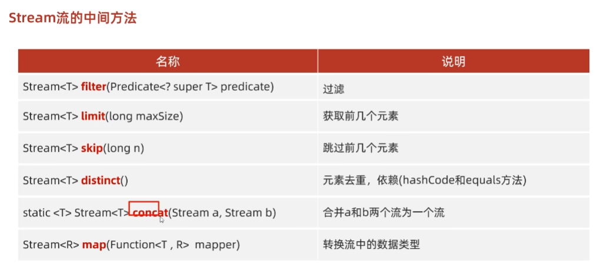
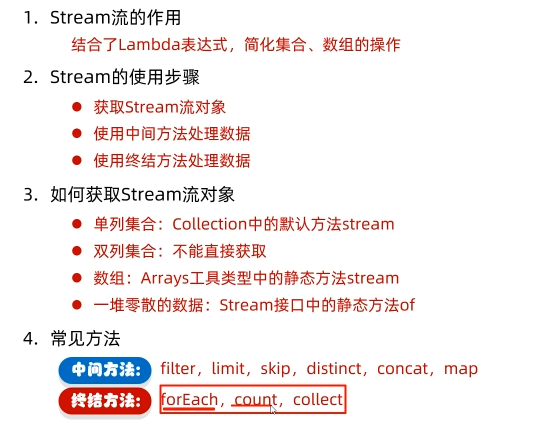

# javaSe

# 好的文章链接：

- <a href="https://blog.csdn.net/zxl646801924/article/details/90374320">Stream教程</a>
-

## Stream流的中间方法

### src/main/java/com/java.stream/stream02




# 1.创建流对象

## 单列集合： 集合对象.stream

```java
List<Author> authors=getAuthors();
        Stream<Author> stream=authors.stream;
```

## 数组： Arrays.stream(数组) 或者使用Stream.of()来创建

```java
Integer[]arr={1,2,3,4,5};
        Stream<integer> stream=Arrays.stream(arr);
        Stream<Integer> stream2=Stream.of(arr);
```

## 双列集合：转换成单列集合后再创建

```java
Map<String, Integer> map=new HashMap<>();
        map.put("蜡笔小新",19);
        map.put("黑子",17);
        map.put("襄阳",20);
        Set<Map.Entry<String, Integer>>entrySet=map.entrySet();
        Stream<Map.Entry<String, Integer>>stream=entrySet.stream();
        stream.filter(s->s.getValue()>17).forEach(System.out::println);
```

# 2.中间操作

## filter：

    可以对流中的元素进行条件过滤，符合条件的才能继续留在流中。

例如： 打印所有姓名长度大于1的作家姓名

```java
List<Author> authors=getAuthors();
        authors.stream()
        .filter(s->s.getName().length()>1)
        .forEach(s->System.out.println(s.getName()));
```

## map：

    可以把流中的元素进行计算或者转换

例如： 打印所有作家的姓名

```java
List<Author> authors=getAuthors();
        authors.stream()
        .map(Author::getName)
        .forEach(System.out::println);
```

## distinct：

    可以去除流中重复的元素

例如： 打印所有作家的姓名，并且要求其中不能有重复元素

```java
 List<Author> authors=getAuthors();
        authors.stream()
        .distinct()
        .forEach(s->System.out.println(s.getName()));
```
<font color=red>*注意：distinct方法是依赖Object的equals方法来判断是否是相同方法的，所以需要注意重写equals方法*</font>

## sorted：
    可以对流中的元素排序

例如：对流中的元素按照年龄进行降序排序，并且要求不能有重复的元素

```java
// 升序
List<Author> authors = getAuthors();
        authors.stream()
        .distinct()
        .sorted(Comparator.comparing(Author::getAge))
        .forEach(s -> System.out.println(s.getName()));
// 降序
List<Author> authors = getAuthors();
        authors.stream()
        .distinct()
        .sorted(Comparator.comparing(Author::getAge).reversed())
        .forEach(s -> System.out.println(s.getName()));
```
* 注意：如果调用空参的sorted()方法，需要流中的元素是实现了Comparable（实体类中）*

## limit：
    可以设置流的最大长度，超出的部分将被抛弃（取多少条数据）
例如：对流中的元素按照年龄进行降序排序，并且要求不能有重复的元素，然后打印其中年龄最大的两个作家的姓名
```java
List<Author> authors = getAuthors();
        authors.stream()
                .distinct()
                .sorted(Comparator.comparing(Author::getAge).reversed())
                .limit(2)
                .forEach(s -> System.out.println(s.getName()));
```

## skip 
    跳过流中的前n个元素，返回剩下的元素
例如：打印除了年龄最大的作家外的其他作家，要求不能有重复元素，并且按照年龄降序排序
```java
List<Author> authors = getAuthors();
        authors.stream()
                .distinct()
                .sorted(Comparator.comparing(Author::getAge).reversed())
                .limit(2)
                .forEach(s -> System.out.println(s.getName()));
```

## flatMap 
    map只能把一个对象转换成另一个对象来作为流中的元素，而flatMap可以把一个对象转换成多个对象作为流中的元素

例一： 打印所有书籍的名字，要求对重复的元素进行去重
```java
List<Author> authors = getAuthors();
        authors.stream()
                .flatMap(s -> s.getBooks()
                        // 将实体类中集合再做流操作
                        .stream()
                        .map(Book::getName))
                .distinct()
                .forEach(System.out::println);
```
例二： 打印现有数据的所有分类，要求对重复的元素进行去重。
```java
List<Author> authors = getAuthors();
        // 使用流处理作者列表
        authors.stream()
                // 将每个作者的书籍流扁平化为单一流
                .flatMap(author -> author.getBooks()
                        .stream())
                // 对书籍进行去重，确保每本书只被处理一次
                .distinct()
                // 将书籍的分类字符串拆分成多个分类，并将其扁平化为单一流
                .flatMap(book -> Arrays.stream(book.getCategory().split(",")))
                // 对分类进行去重，确保每个分类只被处理一次
                .distinct()
                // 对每个分类执行打印操作
                .forEach(System.out::println);
```


# 终结操作

## foreach
    对流中的元素进行遍历操作，我们通过传入的参数去指定对遍历到的元素进行什么具体的操作

例子：输出所有作家的名字
```java
List<Author> authors = getAuthors();
        authors.stream()
                .map(Author::getName)
                .distinct()
                .forEach(System.out::println);
```

## count
    可以用来获取当前流中元素的个数
例子： 打印这些作家的所出书籍的数目，注意删除重复元素

```java
List<Author> authors=getAuthors();
        long count=authors.stream()
        .flatMap(author->author.getBooks().stream())
        .distinct()
        .count();
        System.out.println(count);
```

## max&min
    可以用来获取流中的最值
例子：分别获取这些作家的所出书籍的最高分和最低分并且打印
```java
List<Author> authors=getAuthors();
        Optional<Integer> max=authors.stream()
        .flatMap(author->author.getBooks().stream())
        .map(Book::getScore)
        .max((score1,score2)->score1-score2);

        Optional<Integer> min=authors.stream()
        .flatMap(author->author.getBooks().stream())
        .map(Book::getScore)
        .min((score1,score2)->score1-score2);
        System.out.println(max.get());
        System.out.println(min.get());
```

## collect
    把当前流转换成一个集合

例子：获取一个存放所有作者名字的List集合
```java
List<Author> authors=getAuthors();
        List<String> nameList=authors.stream()
        .map(Author::getName)
        .collect(Collectors.toList());
        System.out.println(nameList);
```
获取一个所有书名的Set集合
```java
List<Author> authors = getAuthors();
        Set<String> collect = authors.stream()
                .flatMap(author -> author.getBooks().stream())
                .map(Book::getName)
                .collect(Collectors.toSet());
        System.out.println(collect);
```
获取一个map集合，map的key为作者名，value为List<Book>
```java
List<Author> authors = getAuthors();
        Map<String, List<Book>> collect = authors.stream()
                .distinct()
                .collect(Collectors.toMap(Author::getName, Author::getBooks));
        System.out.println(collect);
```
## *查找与匹配*
### allMatch
    可以用来判断是否都符合匹配条件，结果为boolean类型，如果都符合结果为true，否则为false.

例子： 判断是否所有的作家都是成年人
```java
List<Author> authors = getAuthors();
        boolean flag = authors.stream()
                .anyMatch(s -> s.getAge() > 18);
        System.out.println(flag);
```

### noneMatch
    可以判断流中的元素是否都不符合匹配条件，如果都不符合结果为true，否则为false

例子：判断作家是否都没有超过100岁的
```java
List<Author> authors = getAuthors();
        boolean b = authors.stream()
                .noneMatch(s -> s.getAge() > 100);
        System.out.println(b);
```

### findAny
    获取流中的任意一个元素，该方法没有办法保证获取的一定是流中的第一个元素

例子：获取任意一个大于18的作家，如果存在就输出他的名字
```java
List<Author> authors = getAuthors();
        Optional<Author> any = authors.stream()
                .filter(s -> s.getAge() > 18)
                .findAny();
        // 判断是否存在 存在输出 不存在不会报空指针异常
        any.ifPresent(s -> System.out.println(s.getName()));
```

### findFirst
    获取流中的第一个元素

例子：获取一个年龄最小的作家，并输出他的名字
```java
List<Author> authors = getAuthors();
        Optional<Author> first = authors.stream()
                .sorted((o1, o2) -> o1.getAge() - o2.getAge())
                .findFirst();
        first.ifPresent(s -> System.out.println(s.getName()));
```
## reduce 
    对流中的数据按照你制定的计算方式计算出一个结果
reduce的作用是把stream中的元素结合起来，我们可以传入一个初始值，她会按照我们的计算方式依次拿流中
的元素和在初始化值的基础上进行计算，计算结果再和后面的元素计算
```java
// 它内部的计算方式如下
T result = identity;
for (T element : this stream)
    result = accumulator.apply(result,element)
return result;
// 其中identity就是我们可以通过方法参数传入的初始值，accumulator的apply具体进行什么计算也是我们通过方法参数来确定的。
```